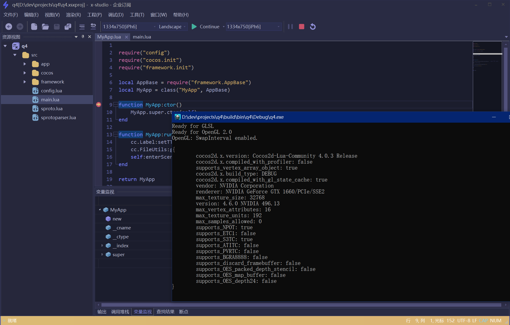

[English](https://github.com/simdsoft/x-studio/blob/master/README_EN.md)

# 仓库介绍

本仓库仅用于`x-studio ide`软件的问题跟踪，研发计划，官方文档更新，并非软件源码

## x-studio 简介

x-studio是一款强大的开发人员IDE；支持Unity32/64(xlua, slua, ulua/tolua)、虚幻引擎(sluaunreal, UnLua)和Cococ2d-x（Lua）调试。 支持类似VSCode，SublimeText的多种编程语言高亮语法着色，打开文件夹，自动完成，自动识别UTF-8/GBK编码，自动识别换行符等功能。 支持Cocos2d-x场景（UI）和2D粒子编辑。Spine运行库版本3.8, DragonBones运行库版本5.5。

## 软件运行效果

  

## x-studio 相关资源:

- 官网: https://x-studio.net/
- 文档: https://docs.x-studio.net/
- 软件下载地址
  - 官方
    - [V2022.1.1 (Build 9900.3)](https://x-studio.net/dl.php?version=10.0.9900.3) - 12/21/2021
  - 360软件宝库: http://soft.360.cn/static/baoku/info_7_0/softinfo_104947374.html
  - 联想软件商店: https://lestore.lenovo.com/detail/25457
  - 腾讯软件中心: https://pc.qq.com/detail/17/detail_25457.html
  - Github发布页面: https://github.com/simdsoft/x-studio/releases
  - 更多版本: https://dl.x-studio.net/
- 新版本前瞻: https://x-studio.net/updates.html

## x-studio 新版本号格式

- 宣传版本号：20xx.x.x
- 构建版本号：10.0.9900.x

## x-studio 2022 未来版本计划

- 将调试体验做到极致
- 全新重构调试器，一套调试核心支持本机注入调试和远程调试
- 多语言混合调试

## 如何通过PayPal购买x-studio
请访问: https://github.com/simdsoft/x-studio/discussions/858

## x-studio 官方QQ群:

- [点击链接加入群聊【x-studio IDE官方群2】](https://jq.qq.com/?_wv=1027&k=eSrJrTIV)
- [点击链接加入群聊【x-studio Pro VIP群】](https://jq.qq.com/?_wv=1027&k=F10LQSJt)
  - 限x-studio会员加入
  - 加入VIP群可提前体验新版本

## 关于软件数字签名

`本软件自V10.0.9000.11起使用Sectigo Limited或Digicert Inc提供数字证书签名，用户在使用无数字签名或者数字签名遭到破坏的版本过程中，造成任何损失，Simdsoft Limited不承担任何责任。` 
