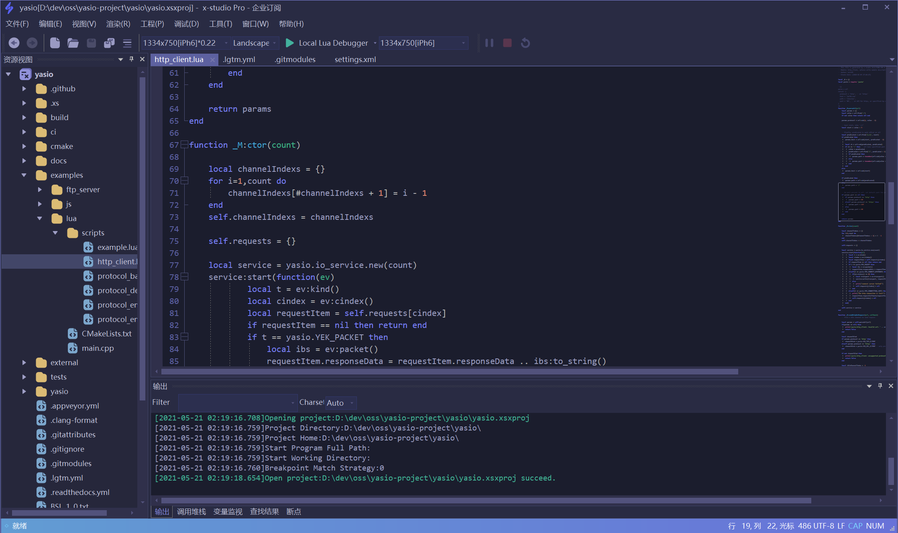

[简体中文](https://github.com/simdsoft/x-studio/blob/master/README.md)

# Repo Introduction

This repo is for `x-studio ide` issues track, develop plan, official documentation update.
  

## x-studio Resources:

- official website: https://x-studio.net/
- documetation: https://docs.x-studio.net/
- Dowload urls
  - official
    - [V2022.1.3 (Build 9900.13)](https://x-studio.net/dl.php?version=10.0.9900.13) - 1/20/2022
  - Microsoft Store: <a href="ms-windows-store://pdp/?productid=XP9KHKZS1M19ZP">ms-windows-store://pdp/?productid=XP9KHKZS1M19ZP</a>
  - 360 software store: http://soft.360.cn/static/baoku/info_7_0/softinfo_104947374.html
  - Lenovo software store: https://lestore.lenovo.com/detail/25457
  - Tecent software center: https://pc.qq.com/detail/17/detail_25457.html
  - Github release page: https://github.com/simdsoft/x-studio/releases
  - More version could be download at: https://dl.x-studio.net/
- Update history: https://x-studio.net/updates.html

## x-studio powered by opensource or commercial softwares

- [Scintilla](https://www.scintilla.org/)
- [msvcr14x](https://github.com/sonyps5201314/msvcr14x)
- [angle](https://github.com/google/angle)
  - [angle-patch](https://github.com/simdsoft/angle-patch)
- [yasio](https://github.com/yasio/yasio)
- [adxe](https://github.com/adxeproject/adxe)
- [BCGControlBar Pro For MFC](https://bcgsoft.com/)
- Full List: https://www.x-studio.net/Licenses.txt

## x-studio Introduction

x-studio is a powerful developer IDE and very lightweight; It support Lua debug such Unity32/64(xlua, slua, ulua/tolua)、UnrealEngine(sluaunreal, UnLua) and Cococ2d-x(Lua), support VSCode，SublimeText like multi program languages highlight, auto complete, auto detect text encoding and etc. It also support cocos2d-x UI and particle system editing.

## Software showcase

## x-studio New version format

- Display version: `202x.x.x`
- Build version: `10.0.9900.x`

## x-studio 2022 (the future)

- [ ] Best debug experience
- [ ] Unify debug kernel, support both inject and remote debug
- [ ] Support Multi program languages mix debug
- [x] Bring missing features: `condition breakpoints` and `step out`

## How to purchase x-studio with PayPal
Please visit: https://github.com/simdsoft/x-studio/discussions/858

## About software code signing

`This software was signed by digit-cert provided by Sectigo Limited or Digicert Inc since V10.0.9000.11, Simdsoft Limited does not assume any responsibility for any loss caused by users who use the version without digital signature or the digital signature is damaged. `
