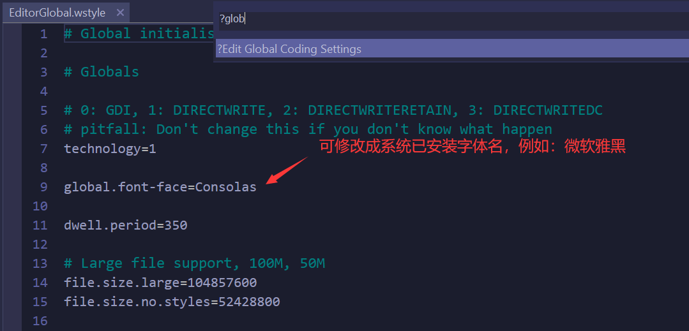
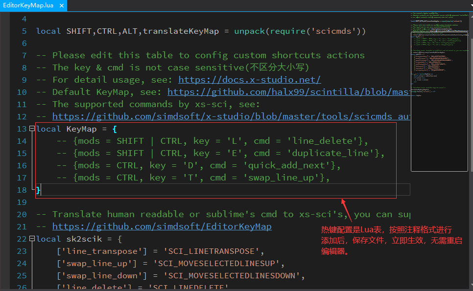
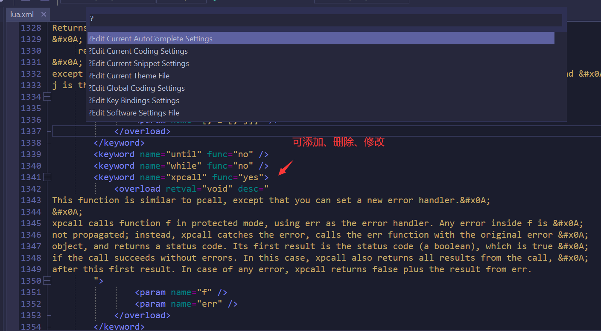

# 代码编辑篇

## 编辑功能概览

* **打开文档自动识别UTF-8、GBK等编码, 没有vs、vscode、xcode、android studio之流带来的乱码烦恼，如此重要的功能还默认关闭，真是...**
* **可配置的Code Snippets代码片段自动完成功能，默认配置了Lua常用的**
* 支持自动识别换行符
* 支持多种字符编码转换
* 支持Ctrl+P快速搜索工程文件
* 支持Ctrl+R快速搜索当前代码文件所有函数
* 支持Ctrl+F当前文档查找，可查找全部匹配项
* 支持Ctrl+H当前文档替换功能
* **支持Ctrl+Shift+F全工程文件内容搜索，搜索支持正则表达式，搜索范围可随意粘贴任意目录，并会记录，非常好的体验，visual studio在2019的某个版本才修改为这种体验哦**
* 支持在任意目录下文件内容搜索, 工程中可右键资源视图快捷搜索某个目录
* 支持Ctrl+Tab快速切换最近打开文件列表
* 支持Ctrl+-/Ctrl+Shift+-前后导航功能
* 支持Ctrl+F2更改当前文档所有匹配项
* 支持Ctrl+D加选下一匹配项
* 支持Alt+鼠标块选文本
* 支持代码自动完成
* 支持Ctrl+I格式化Lua代码，选中代码或当前文档代码
* 支持Ctrl+B调用 [luacheck](https://github.com/mpeterv/luacheck) 对Lua代码进行静态分析
* 支持Ctrl+/注释Lua代码
* 支持以二进制Ascii视图查看二进制文件
* **支持快速打开和保存100M左右的大文件**
* 内置5种代码主题，通过Ctrl+Alt+Num9进行切换
* **集成 Clang-Format-13.0, 可通过快捷键Ctrl+I格式化C++,Java,C#等代码**
* 高性能的输出窗口，输出窗口支持过滤
* 支持自定义命令工具配置，命令工具执行日志将被直接捕获到输出窗口
* 支持根据luacheck警告、msvc编译错误、android ndk编译错误等信息在输出窗口快速定位文件

## 编辑器字体

软件默认代码编辑器字体是 ``Source Code Pro``, 如果不喜欢可以通过快捷键 ``Ctrl+Shift+P`` 打开快捷命令对话框，
然后选择 ``Edit Global Coding Settings`` 打开全局代码配置文件，找到 ``global.font-face`` ， 
修改字体后保存即可立即生效，如图所示：

  

## 编辑器快捷键

### 编辑快捷键建配置文件

通过Ctrl+Shift+P调出快捷菜单，选择 ``Edit Key Bindings Settings`` 打开并编辑快捷键配置文件保存后立即生效,
如图所示:



!!! note ""

  如果，不生效则，可能是和系统热键冲突，或者和软件核心框架热键冲突; 软件核心框架热键会在后续文档更新中列出，例如新建工程，调试等。

### 编辑器支持的命令列表

```lua

 -- 支持的命令
 scicmds = {
    SCI_LINEDOWN = 2300,
    SCI_LINEDOWNEXTEND = 2301,
    SCI_LINEDOWNRECTEXTEND = 2426,
    SCI_LINESCROLLDOWN = 2342,
    SCI_LINEUP = 2302,
    SCI_LINEUPEXTEND = 2303,
    SCI_LINEUPRECTEXTEND = 2427,
    SCI_LINESCROLLUP = 2343,
    SCI_PARADOWN = 2413,
    SCI_PARADOWNEXTEND = 2414,
    SCI_PARAUP = 2415,
    SCI_PARAUPEXTEND = 2416,
    SCI_CHARLEFT = 2304,
    SCI_CHARLEFTEXTEND = 2305,
    SCI_CHARLEFTRECTEXTEND = 2428,
    SCI_CHARRIGHT = 2306,
    SCI_CHARRIGHTEXTEND = 2307,
    SCI_CHARRIGHTRECTEXTEND = 2429,
    SCI_WORDLEFT = 2308,
    SCI_WORDLEFTEXTEND = 2309,
    SCI_WORDRIGHT = 2310,
    SCI_WORDRIGHTEXTEND = 2311,
    SCI_WORDLEFTEND = 2439,
    SCI_WORDLEFTENDEXTEND = 2440,
    SCI_WORDRIGHTEND = 2441,
    SCI_WORDRIGHTENDEXTEND = 2442,
    SCI_WORDPARTLEFT = 2390,
    SCI_WORDPARTLEFTEXTEND = 2391,
    SCI_WORDPARTRIGHT = 2392,
    SCI_WORDPARTRIGHTEXTEND = 2393,
    SCI_HOME = 2312,
    SCI_HOMEEXTEND = 2313,
    SCI_HOMERECTEXTEND = 2430,
    SCI_HOMEDISPLAY = 2345,
    SCI_HOMEDISPLAYEXTEND = 2346,
    SCI_HOMEWRAP = 2349,
    SCI_HOMEWRAPEXTEND = 2450,
    SCI_VCHOME = 2331,
    SCI_VCHOMEEXTEND = 2332,
    SCI_VCHOMERECTEXTEND = 2431,
    SCI_VCHOMEWRAP = 2453,
    SCI_VCHOMEWRAPEXTEND = 2454,
    SCI_VCHOMEDISPLAY = 2652,
    SCI_VCHOMEDISPLAYEXTEND = 2653,
    SCI_LINEEND = 2314,
    SCI_LINEENDEXTEND = 2315,
    SCI_LINEENDRECTEXTEND = 2432,
    SCI_LINEENDDISPLAY = 2347,
    SCI_LINEENDDISPLAYEXTEND = 2348,
    SCI_LINEENDWRAP = 2451,
    SCI_LINEENDWRAPEXTEND = 2452,
    SCI_DOCUMENTSTART = 2316,
    SCI_DOCUMENTSTARTEXTEND = 2317,
    SCI_DOCUMENTEND = 2318,
    SCI_DOCUMENTENDEXTEND = 2319,
    SCI_PAGEUP = 2320,
    SCI_PAGEUPEXTEND = 2321,
    SCI_PAGEUPRECTEXTEND = 2433,
    SCI_PAGEDOWN = 2322,
    SCI_PAGEDOWNEXTEND = 2323,
    SCI_PAGEDOWNRECTEXTEND = 2434,
    SCI_STUTTEREDPAGEUP = 2435,
    SCI_STUTTEREDPAGEUPEXTEND = 2436,
    SCI_STUTTEREDPAGEDOWN = 2437,
    SCI_STUTTEREDPAGEDOWNEXTEND = 2438,
    SCI_DELETEBACK = 2326,
    SCI_DELETEBACKNOTLINE = 2344,
    SCI_DELWORDLEFT = 2335,
    SCI_DELWORDRIGHT = 2336,
    SCI_DELWORDRIGHTEND = 2518,
    SCI_DELLINELEFT = 2395,
    SCI_DELLINERIGHT = 2396,
    SCI_LINEDELETE = 2338,
    SCI_LINECUT = 2337,
    SCI_LINECOPY = 2455,
    SCI_LINETRANSPOSE = 2339,
    SCI_LINEREVERSE = 2354,
    SCI_LINEDUPLICATE = 2404,
    SCI_LOWERCASE = 2340,
    SCI_UPPERCASE = 2341,
    SCI_CANCEL = 2325,
    SCI_EDITTOGGLEOVERTYPE = 2324,
    SCI_NEWLINE = 2329,
    SCI_FORMFEED = 2330,
    SCI_TAB = 2327,
    SCI_BACKTAB = 2328,
    SCI_SELECTIONDUPLICATE = 2469,
    SCI_VERTICALCENTRECARET = 2619,
    SCI_MOVESELECTEDLINESUP = 2620,
    SCI_MOVESELECTEDLINESDOWN = 2621,
    SCI_SCROLLTOSTART = 2628,
    SCI_SCROLLTOEND = 2629,
    SCI_QUICKADDNEXT = 2911,
 }
```

### 编辑器支持的按键代码列表

```lua

  -- 可见字符，直接输入字符即可, 例如'E','D'等
  -- 以下是编辑器支持的非可见字符按键:
  
    'PRIOR',
    'BACK',
    'TAB',
    'ADD',
    'RETURN',
    'DOWN',
    'HOME',
    'DELETE',
    'WIN',
    'UP',
    'LEFT',
    'RIGHT',
    'END',
    'NEXT',
    'INSERT',
    'ESCAPE',
    'SUBTRACT',
    'DIVIDE',
    'RWIN',
    'MENU',
    'F1',
    'F2',
    'F3',
    'F4',
    'F5',
    'F6',
    'F7',
    'F8',
    'F9',
    'F10',
    'F11',
    'F12',

```

## 配置当前编程语言自动完成

例如修改Lua, 则先随便打开一个Lua文件，然后通过Ctrl+Shift+P调出快捷菜单，选择 ``Edit Current AutoComplete Settings`` 打开文件编辑相应keyword，保存后重启编辑器生效,
如图所示:


