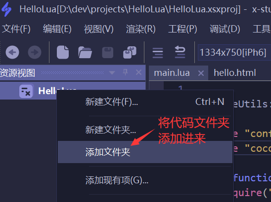
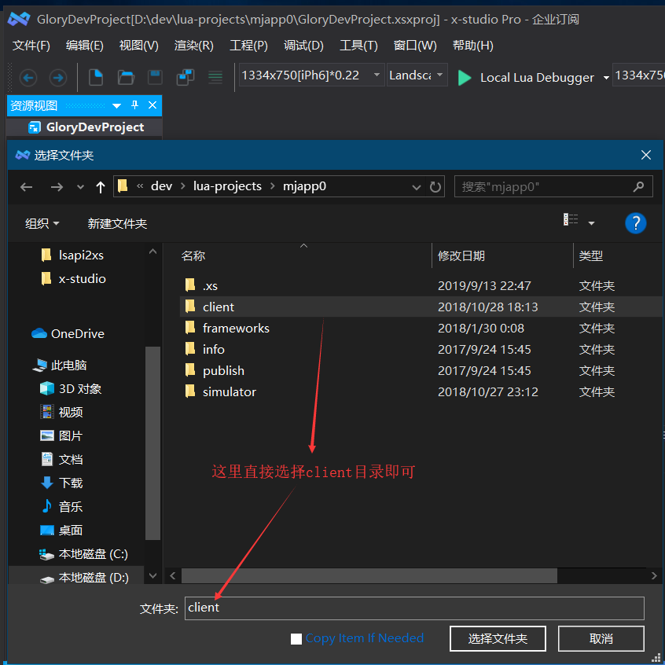
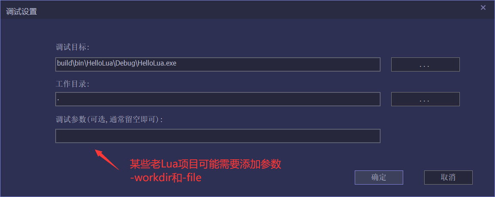
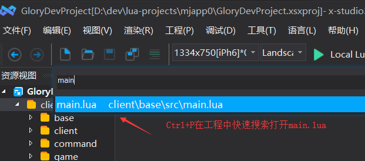
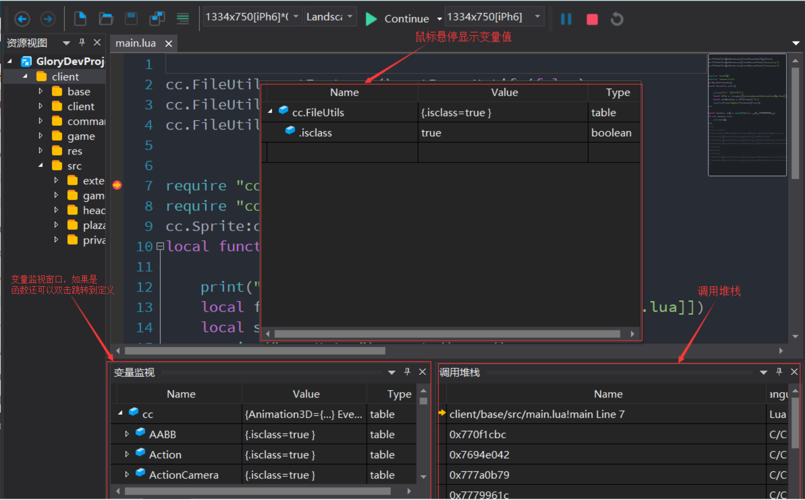

# Cocos2d-x Lua调试

## 基本步骤

### 新建工程

   通过软件主菜单【文件】【新建工程】，在弹出的新建工程对话框中，工程类型设置为Lua Debug, 然后点【自定义引擎脚本…】按钮，选择游戏exe，
   工程路径请选择cocos项目的根目录，工程名随便起一个，例如GloryProjectDev，如下图所示：

   

### 添加代码文件夹

   点击对话框【确定】按钮，调试工程就创建好了。为了在开发过程中能快速打开Lua代码文件，先将项目Lua代码文件添加进来，在资源视图右键菜单【添加文件夹】进行添加，如图所示：

   

   

### 配置调试参数

   通过软件菜单【调试】【调试设置】打开调试设置对话框，修改工作目录为client, 设置调试 参数为:
   `-workdir $(ProjectDir)client -file $(ProjectDir)client/base/src/main.lua`,
   点击保存工程按钮，保存调试工程，下次可在最近工程中打开，如图所示：

   

!!! attention "注意"

    对于绝大多数cocos2d-x lua版本(quick-lua待验证），调试参数必须配置；这是由于simulator本身设计缺陷。

### 启动调试

   通过以上3步，项目的Lua调试工程就创建成功了，
   用快捷键Ctrl+P搜索项目文件打开main.lua，按F9打断点，按F5启动调试，
   命中断点后，可查看调用堆栈，将想要查看值的变量拖入变量监视窗口，调试操作及快捷键和VisualStudio完全一致，如图所示：

   

   

!!! attention "注意事项"

    * 如果通过以上设置后，启动调试游戏闪退，请尝试删除exe同目录下的.dcache后缀文件后再重试
