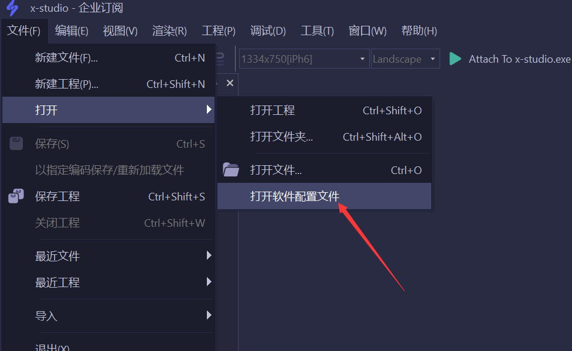
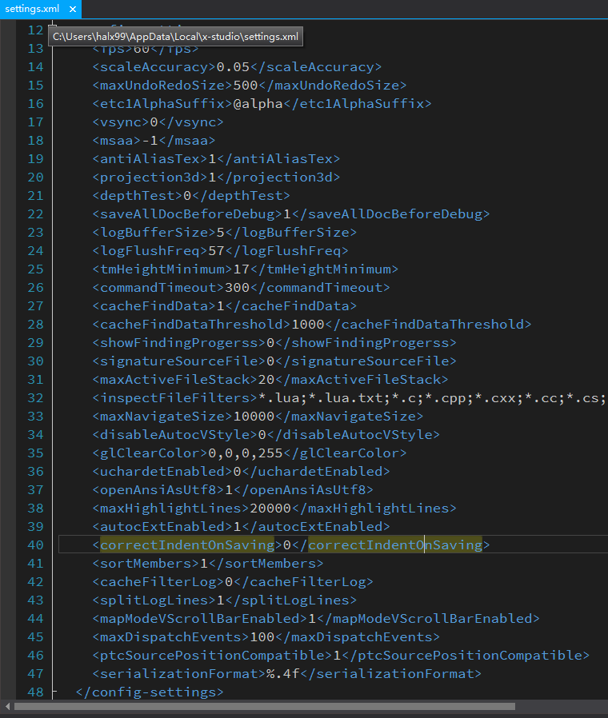

# 软件配置

## 打开软件配置

   通过软件主菜单【文件】【打开】【打开软件配置文件】即可快速打开软件配置进行编辑，如图所示：

   

   

## 软件各配置说明

   * ``config-settings`` 属性说明

    |属性         | 功能     |
    | ------------- |:----------------:|
    | fps                                     | 渲染场景帧率                                                                                                                   |
    | scaleAccuracy                           | 渲染场景缩放粒度                                                                                                               |
    | maxUndoRedoSize                         | 场景编辑器最大撤销反撤销数                                                                                                     |
    | etc1AlphaSuffix                         | ETC1格式透明纹理后缀                                                                                                           |
    | vsync                                   | 是否渲染场景垂直同步，若开启则帧率会锁定在60fps                                                                                |
    | msaa                                    | 多重采样抗锯齿, 有效值2,4,8                                                                                                    |
    | antiAliasTex                            | 是否默认开启纹理抗锯齿                                                                                                         |
    | projection3d                            | 3D投影矩阵                                                                                                                     |
    | depthTest                               | 是否开启深度测试                                                                                                               |
    | saveAllDocBeforeDebug                   | 在启动调试前是否保存所有已修改文档                                                                                             |
    | logBufferSize                           | 日志缓冲区大小，默认为5M， 单位Mbytes                                                                                          |
    | logFlushFreq                            | 日志输出频率                                                                                                                   |
    | tmHeightMinimum                         | 监视窗口最小文本高度，通常不需要修改                                                                                           |
    | commandTimeout                          | 命令超时时间，毫秒                                                                                                             |
    | cacheFindData                           | 是否缓存全工程内容搜索文件数据                                                                                                 |
    | cacheFindDataThreshold                  | 缓存全工程内容搜索最大文件数                                                                                                   |
    | showFindProgressDlg                     | 是否显示全工程搜索进度对话框                                                                                                   |
    | signatureSourceFile                     | 新建文件是否带UTF-8签名                                                                                                        |
    | inspectFileFilters                      | 支持检索代码文件的文件类型                                                                                                     |
    | maxActiveFileStack                      | 最大活动文件栈大小                                                                                                             |
    | maxNavigateSize                         |最大前进后退导航书签数                                                                                                          |
    | glClearColor                            | 场景默认底色RGBA值                                                                                                             |
    | maxHighlightLines                       | 自动高亮选中文本最大行数                                                                                                       |
    | openAnsiAsUtf8                          | 是否已utf-8模式打开纯ansi文本                                                                                                  |
    | autocExtEnabled                         | 是否启用扩展API是，目前默认扩展API提示是cocos2d-x-3.16, 可通过修改软件安装目录下settings\cprops\lua.properties文件中配置来修改 |
    | correctIndentOnSaving                   | 是否在保存时修正文档缩进，默认值0， 不修正                                                                                     |
    | sortMembers                             | 是否排序成员，默认值1， 启用排序，会略微影响变量监视性能                                                                       |
    | cacheFilterLog                          | 是否开启日志过滤缓存，启用后，过滤行为类似xcode, 但注意，大量日志时，可能会导致编辑器卡顿， 默认值0，关闭                      |
    | splitLogLines                           | 是否分割日志行，以启用按行过滤，默认值0                                                                                        |
    | mapModeVScrollBarEnabled                | 是否启用MiniMap垂直滚动条，默认值1，启用                                                                                       |
    | serializationFormat                     | 浮点数序列化格式，默认值%.4f                                                                                                   |
   
   * ``clang-format-options/fallback-style``  
    ClangFormat格式化fallback代码风格配置，可取值：
    ``Microsoft, LLVM, Chromium, Google, Mozilla, WebKit``

    详见Clang-Format官方文档：https://clang.llvm.org/docs/ClangFormat.html

   * ``luacheck-params``  
   执行Lua代码静态检查参数, 具体可查看Luacheck文档：https://luacheck.readthedocs.io/en/stable/

   * ``designsize-list``  
   添加软件UI编辑设计尺寸支持，根据需求随意添加

## 配置生效说明

   * 立即生效的配置: ``clang-format-options/fallback-style``, ``luacheck-params``

   * 下次启动生效的配置: ``config-settings``, ``designsize-list``
