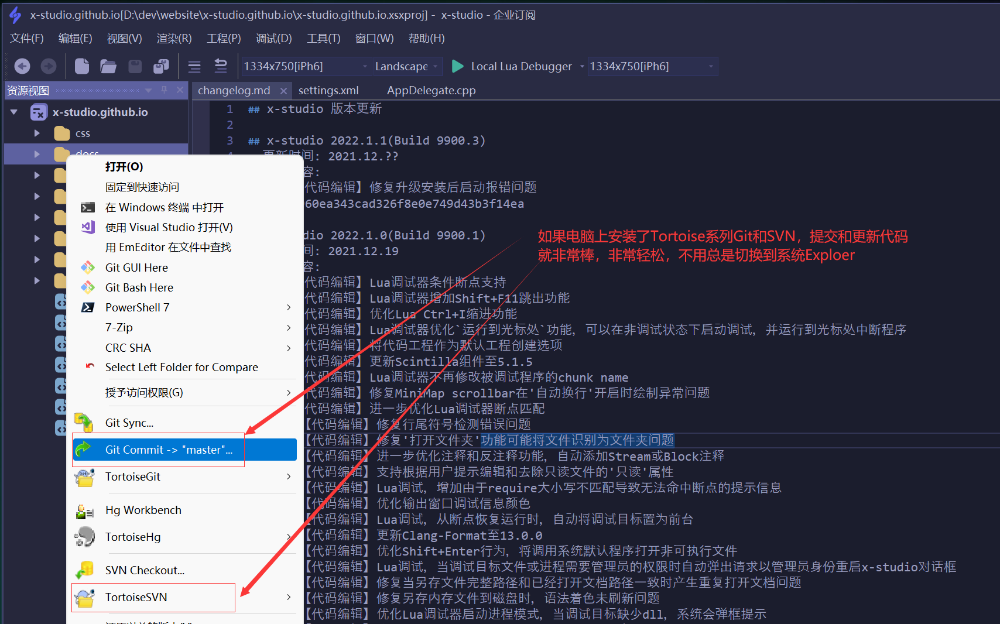
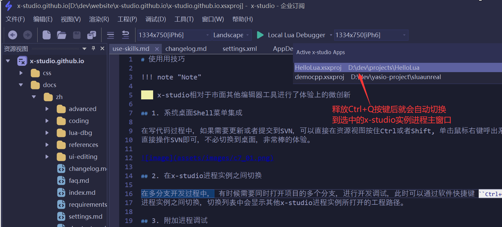

# 使用用技巧

!!! note "Note"

    x-studio相对于市面其他编辑器工具进行了体验上的微创新

## 1. 系统桌面Shell菜单集成

在写代码过程中，如果需要更新或者提交到SVN，可以直接在资源视图按住Ctrl或者Shift, 单击鼠标右键呼出系统桌面菜单
直接操作SVN即可，不必切换到桌面，非常棒的体验。

## 2. 在x-studio进程实例之间切换

在多分支开发过程中， 有时候需要同时打开项目的多个分支，进行开发调试，此时可以通过软件快捷键 ``Ctrl+Q`` 快速在x-studio
进程实例之间切换，切换列表中会显示其他x-studio进程实例所打开的工程路径。

## 3. 附加进程调试

由于调试对被调试程序性能本身会有一定影响，当我们调试游戏，登录加载过程比较慢时，可以直接启动游戏，当进入游戏后，我们在附加
到游戏进程，在我们需要调试的游戏场景代码文件打断点调试即可。  
**tips: 每次附加调试后，调试进程会记录在快速启动调试菜单按钮(Quick Menu Button)里方便选择，
Visual Studio也有Menu Button, 但是是固定的，例如(Local Window Debugger, Attach To Unity等)**

## 4. 使用x-studio计算文件的md5、sha1、sha256、sha512值，支持4GB+超大文件

1. 右键菜单，`Hash with x-studio`下拉菜单选择hash算法
      

2. 计算进度对话框

      

3. 计算完成后结果显示

      
